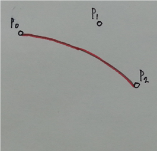
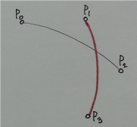
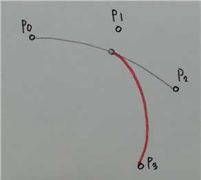
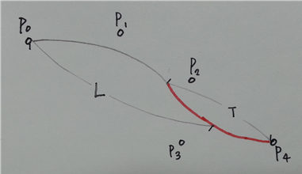
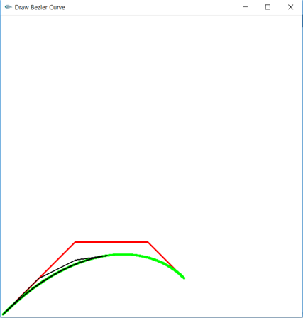
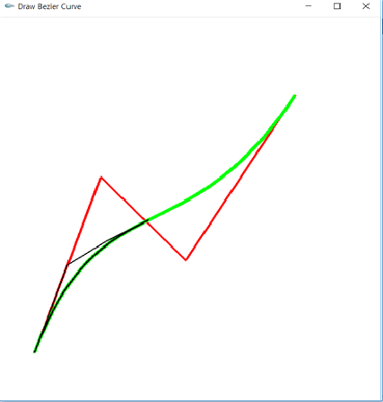
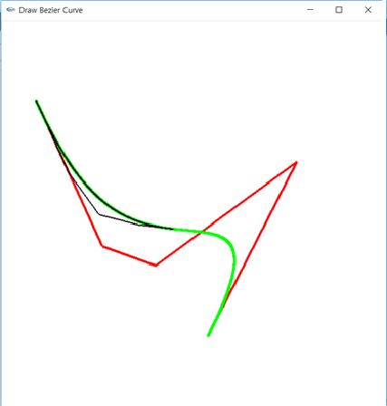

## 베지어 곡선 그리기
마우스 클릭으로 n차 베지어 곡선을 그리는 프로그램으로, 
렌더링은 OpenGL 라이브러리를 사용하여 진행했다
## 구현
마우스로 입력받은 좌료를 벡터에 받고 이로부터 베지어 곡선의 좌표를 계산하여 화면에 표시한다

 마우스를 클릭할 때마다 벡터에 새 정점을 추가한다. 2차 베지어 곡선을 그리는 경우를 예시로 들었다.

p0, p1, p2를 차례로 입력하면 다음과 같은 곡선을 그린다.

그러나 p3까지 입력할 경우, 마지막으로 생성된 베지어 곡선은 이전의 곡선과 이어지지 않게된다.
(2차 베지어 곡선은 3개의 정점만을 사용하기 때문) 

이를 해결하기 위해 p3 입력 후 새 베지어곡선을 그릴 때, p1 대신에 직전 베지어곡선의 중점을 새 곡선의 첫 번째 정점으로 사용했다.

※위의 예시는 2차 베지어 곡선을 사용하기 때문에 직전 곡선의 중점을 시작점으로 사용하였지만, n차 베지어 곡선을 사용할 경우에는 1/n위치의 정점을 사용해야 한다.

※입력한 점이 n+1개(n차 이므로)미만일 때는 p0 에서부터 마지막 점까지 구한 베지어 곡선이 현재 곡선이 된다.

정점들을 저장할 vector는 다음 3개를 사용한다.

- vector<point> P : 클릭한 정점들을 저장

- vector<point> T : 사용자가 정한 차수에 따른 현재의 베지어곡선의 정점을 저장

- vector<point> L : T에서 넘겨받은 정점들을 저장. 전체 곡선을 나타냄

마우스로 입력받은 정점은 차례대로 P에 저장된다. T에는 현재 베지어곡선의 정점들을 저장한다(t = 0 ~ 1). T의 정점 중 t < 1 / n인 정점들은 L에 추가하며 L은 전체 곡선을 나타내게 된다.

마우스 오른쪽을 클릭하면 현재 획을 마치고 다음 획을 그릴 수 있도록 한다. 현재 T에 있는 모든 정점들을 L에 저장하고 T를 비운다. 이어서 L에는 화면 밖의 좌표를 갖는 정점을 추가하여 획이 끝났다는 것을 나타낸다.

사용자가 폰트를 확대ㆍ축소 및 상하좌우로 이동할 수 있도록 한다(키보드 입력을 통해 모델좌표계를 조절한다). 또한 키보드로 차수를 입력해 조절하도록 한다.

## 사용방법
- 왼쪽클릭 : 획을 새로 시작하거나 이어서 점을 찍음
- 오른쪽 클릭 : 마지막 점을 찍고 획을 마침
- 키보드 입력으로 확대, 축소, 상하좌우 이동 및 차수 변경

Q : 화면확대
E : 화면축소
A : 좌로 이동
D : 우로 이동
W : 위로 이동
S : 아래로 이동
N : 차수 변경(단, 한 획을 그리는 도중에는 변경할 수 없음)

## 결과

 

 

- 빨간색 직선은 입력받은 정점 (p0~pn)을 연결한 직선이다
- 검은색 곡선은 중간점까지의 곡선이며 (t=0.5) 검은색 직선은 중간점이 구해진 과정을 나타낸다
- 초록색 곡선은 완성된 베지어 곡선이다 